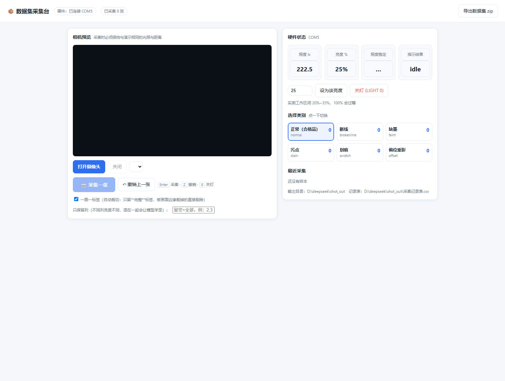
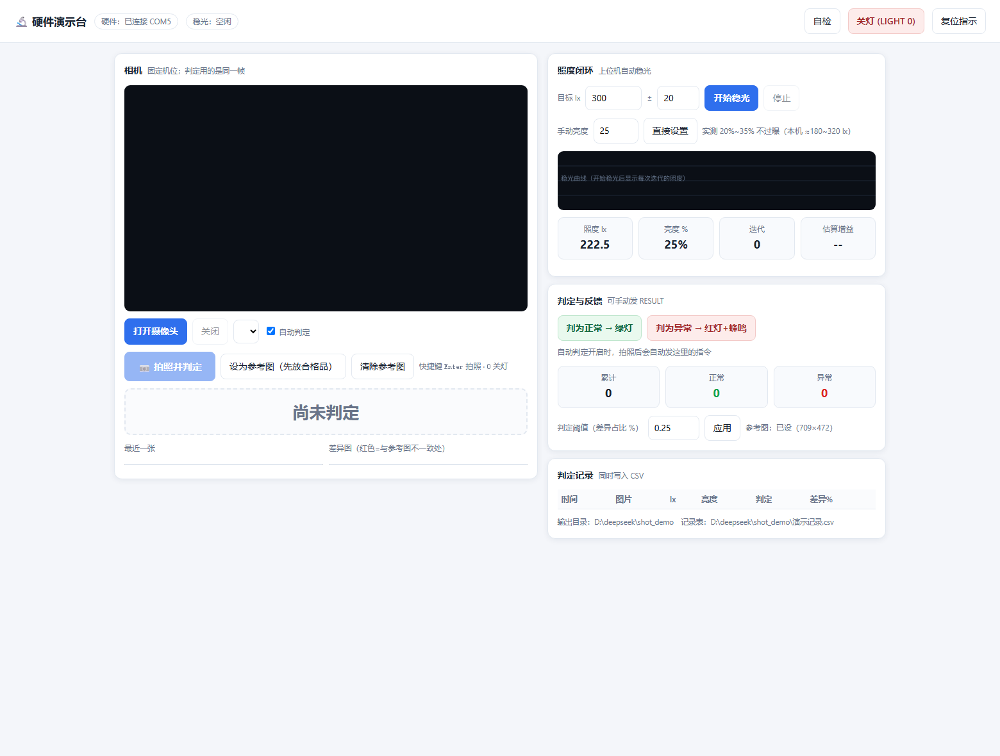

# LIGHTGUARD 硬件系统 · 光照闭环 + 数据集生产线

给工业视觉质检配一套**会自己稳住光照**的硬件：ESP32 测光 → 调光 → 闭环稳光，
红绿声光给出检测结果，再配一个**可复现的数据集采集台**，把"采集 → 训练 → 检测"串成闭环。

> 本仓库**只包含硬件部分**（固件、接线、实测记录、数据集设计与采集工具），
> 不含任何软件系统的源代码与模型权重。

---

## 界面预览

两个上位机工具都是**自带页面的本地程序**，下面是真实运行的界面截图：

| 数据集采集台（一图一标签，自动裁切） | 硬件演示台（闭环稳光 + 判定反馈） |
|---|---|
|  |  |

> 截图中间那块**黑色区域是相机预览区**：它需要本地摄像头权限，无头浏览器截不出画面，
> 在真机上打开就是实时画面（截图里的 222.5 lx / 25% 是真实硬件读数）。
> 两个工具都是 **Flask 本地程序**（要 Python + 串口 + 摄像头），**GitHub 上跑不起来**
> —— GitHub Pages 只能托管静态页面。想看活的界面：下载仓库后双击
> `05_数据集与标签设计/console/0_启动采集台.bat` 或 `硬件演示系统/演示台/0_启动演示台.bat`。

---

## 一、这套硬件解决什么问题

视觉检测最怕的不是算法，而是**光照不稳定**：同一张标签，光变了，像素分布就变了，模型就判错。
本系统用"**闭环稳光**"把这件事按住：

```
 BH1750 照度传感器 ──I2C──▶ ESP32 ──PWM──▶ MOS 模块 ──▶ 5V COB 灯带
        ▲                     │
        └────── 实测照度 ◀─────┘   （比例控制 + 步长限幅 + 死区，自动收敛到目标照度）
                              └──▶ 红/绿指示 + 蜂鸣器：正常 / 异常
```

配套的**数据集采集台**保证采出来的照片"光照条件完全一致"，
并且把每张图当时的**照度、亮度、时间**一起写进记录表 —— 数据可追溯，训练可复现。

---

## 二、目录导航

| 位置 | 内容 |
|---|---|
| `00_从采购到参赛_执行总表.md` | 从采购到参赛的执行总表（时间线、验收点） |
| `01_ESP32固件/` | **正式固件** `lightguard_esp32.ino` + 5 个验证固件 + 一键烧录脚本 `flash_manual.ps1` |
| `02_硬件安装与接线/` | 接线图、引脚表、接线速查卡（一页打印版）、安装核对单 |
| `03_采购清单/` | 最低成本采购清单（含型号与替代方案） |
| `04_硬件验证记录/` | **逐项实测记录**（原始串口日志、镜像 Hash 校验、闭环数据、频闪量化） |
| `05_数据集与标签设计/` | 6 类标签图案与 A4 打印页、采集说明、批处理脚本、网页采集台、**独立采集台 `console/`** |
| `硬件演示系统/` | 最小硬件版的搭建与演示步骤 + **上位机演示软件 `演示台/`**（自动稳光 + 拍照判定 + 红绿声反馈） |
| `演示视频拍摄脚本.md` | 演示视频分镜与旁白（含口径提醒） |

---

## 三、硬件清单

| 部件 | 型号 / 规格 | 接到哪 |
|---|---|---|
| 主控 | ESP32 开发板（ESP32-D0WD-V3，4 MB Flash） | — |
| 照度传感器 | BH1750（I2C，地址 0x23） | SDA=GPIO21，SCL=GPIO22，3V3 |
| 灯带 | 5V COB 灯带 8 mm 300 灯/米 1 米（中性光） | 经 MOS 模块供电 |
| 驱动模块 | MOSFET 模块（逻辑电平，`DC± / OUT± / IN±`） | GPIO25 → `IN+` |
| 电源 | 5V 4 A 适配器（灯带独立供电） | 灯带 + MOS 模块 |
| 指示 | 绿色 LED、红色 LED、有源蜂鸣器 | GPIO26 / GPIO27 / GPIO32 |
| 摄像头 | USB UVC 免驱摄像头（1920×1080） | USB |

**三条硬规矩**：

1. 灯带**不能直接接 GPIO**，必须经 MOS 模块；ESP32 与灯带 5V 电源**必须共地**；
2. 绿 = 正常（GPIO26）、红 = 异常（GPIO27），**别接反**；
3. 换用 ≤1 kHz 的驱动模块时，PWM 频率要相应改回 1 kHz（本仓库默认 **8 kHz**）。

---

## 四、快速开始

### 1. 烧录（这块板**没有自动下载电路**，必须手动进下载模式）

```
按住 BOOT 不放 → 按一下 EN/RST → 松开 BOOT → 双手离开板子 → 开始烧录
```

不想掐时间就用脚本，它会一直等到你按完 BOOT 再开始烧：

```powershell
powershell -ExecutionPolicy Bypass -File .\01_ESP32固件\flash_manual.ps1 -Sketch .\01_ESP32固件\lightguard_esp32.ino
```

### 2. 先跑验证固件，再上正式固件

`01_ESP32固件/` 里每个外设都有一个**独立验证固件**（`esp32_blink_test`、`bh1750_test`、
`light_pwm_test`、`indicator_test`、`mos_polarity_probe`），按顺序跑一遍就知道哪一段没接好。

### 3. 采集数据集（独立采集台）

```powershell
cd 05_数据集与标签设计\console
py -3.11 -m pip install flask pyserial     # 只需一次
py -3.11 dataset_console.py                # 自动找 ESP32 串口，浏览器自动打开
```

浏览器里：打开摄像头 → 设为 25% 亮度 → 等"照度稳定" → 选类别 → **Enter** 采集。

> 还没接硬件也能先跑流程：`py -3.11 dataset_console.py --no-serial`

### 4. 跑硬件闭环演示（上位机演示软件）

```powershell
cd 硬件演示系统\演示台
py -3.11 -m pip install flask pyserial numpy pillow opencv-python   # 只需一次
py -3.11 demo_console.py                    # 自动找串口，浏览器自动打开
```

页面里三步：**放合格品 → 点「设为参考图」** → **稳光**（目标 300 lx ±20）→ **换待检品按 Enter**，
页面给出 ✅正常 / ⛔异常，**硬件同时亮绿灯或红灯**（异常还会短鸣）。

> 不接硬件也能看界面：`py -3.11 demo_console.py --no-serial`
> 判定模块可单独自测：`py -3.11 test_detect_ref.py`（合成图 10 项）

同目录还有三个现场必备的小工具：

| 工具 | 作用 |
|---|---|
| `calibrate_lux.py` + `0_照度标定.bat` | 换位置后重新标定照度（拟合 lx/每1%），**自动判断目标照度与相机不过曝区间是否冲突**，导出 Markdown 报告 |
| `light_off.py` + `关灯_应急.bat` | **应急关灯**：程序被强杀、板子刚复位后一键关灯，并回读硬件确认 |
| `banding_check.py` | 频闪条纹复测（PWM 频率 × 卷帘快门），自动挑最平坦区域算行 σ，抓帧默认测完即删 |

> 运行任何抓帧/录制前，先确认画面里没有证件、表格、聊天窗口等个人内容。

### 5. 搭建与现场演示

`硬件演示系统/最小硬件版_搭建与演示.md` 有完整步骤（含上电顺序与安全操作）。

---

## 五、实测结论（都有原始记录，见 `04_硬件验证记录/`）

| 结论 | 数据 | 适用范围 |
|---|---|---|
| **上位机照度闭环（真机通过）** | 目标 300 ± 20 lx：25% → 223.3 lx → 31% → **283.3 lx，9.1 秒收敛** | 演示台 `light_loop.py` + 正式固件 `LIGHT n`（增益自动估算） |
| 照度标定曲线（真机） | 0%→0、25%→224.2、50%→466.7、100%→965.8 lx；拟合 **9.77 lx / 每 1% 亮度** | 当前几何（传感器在桌面）；换位置必须重标 |
| ★ **900 lx 与相机曝光冲突** | 本几何下达到 900 lx 需 **94.1% 亮度**，而 100% 已过曝；相机安全区间 20%~35% 只对应 **179~322 lx** | 需把传感器移入箱内最终位置重标，或改验收点 |
| **拍照 → 判定 → 硬件反馈闭环** | 用 6 种真实标签图案：正常判正常（0.000%），5 种缺陷全判异常（0.33%~22.2%），**串口回读的红绿指示每次都对** | 演示台 `detect_ref.py`（参考图比对） |
| **PWM 1 kHz 会让相机画面出现频闪条纹** | 三帧行均值波动标准差 8.85 / 8.78 / 8.80（≈满量程 3.5%），固定相位 —— 典型的"PWM × 卷帘快门" | 实测 |
| **改成 8 kHz 抑制条纹** | 周期 125 µs，单行曝光跨越多个周期被平均掉 | 已改代码，**待按同一方法复测** |
| **100% 亮度会过曝** | 纸面一片白、文字被冲掉 | 实测，箱内工作区间取 **20%~35%** |
| 读数纪律 | 改亮度后必须**等 2.2 秒以上**再读，否则会读到乱数（15%→12.5 lx 这种） | 已写进上位机软件 |

> 口径说明：闭环现由**上位机**实现并在真机验证通过；正式固件本身仍只提供 `LIGHT n` 手动调光。
> 我们不在文档里把"上位机跑通"写成"固件内置闭环"。

---

## 六、串口协议（固件 ↔ 上位机）

115200 波特率，一行一条 JSON：

| 命令 | 回复 |
|---|---|
| `PING` | `{"ok":true,"device":"LIGHTGUARD_ESP32"}` |
| `STATUS` | `{"ok":true,"lux":123.4,"brightness":25,"result":"idle"}` |
| `LIGHT <0-100>` | 设置灯带亮度，并回一条 `STATUS` |
| `RESULT normal\|abnormal\|idle` | 设置红绿指示与蜂鸣，并回一条 `STATUS` |

---

## 七、数据集是怎么设计的

- **6 个类别**：正常、断线、缺墨、污点、划痕、偏位重影（缺陷都做到**人眼明显可见**）；
- **标签尺寸 60 × 40 mm**：一页 A4 排 **18 个**，页脚带 **100 mm 校验尺**（打印后量一下，确认没被缩放）；
- **一图一记录**：文件名、类别、缺陷类型、**照度 lx**、**亮度 %**、时间，写进 `采集记录表.csv`（带 BOM，Excel 直接打开）；
- **一致性纪律**：固定亮度、盖上箱盖、锁定焦距、机位不动；
  训练 / 验证 / 测试**按样本划分而不是按图片划分**（同一张标签的多张照片必须进同一个集合）。

---

## 八、现场演示前务必确认的坑

| # | 坑 | 说明 |
|---|---|---|
| 1 | 烧录要按 BOOT | 本板无自动下载电路，属正常现象 |
| 2 | 必须共地 | 灯带 5V 电源与 ESP32 不共地 → PWM 完全失控（常亮或乱闪） |
| 3 | MOSFET 要逻辑电平型号 | 老式 IRF520 在 5V 栅压下会发烫，别用 |
| 4 | BH1750 用 3V3 | 不要接 5V |
| 5 | **别留下亮着的灯带** | 正式固件默认亮度已改为 **0%**（复位也不会亮）；但调光仍需显式 `LIGHT n`，收尾建议发 `LIGHT 0` |
| 6 | 避开 GPIO6~11 / 34~39 | 前者接 Flash，后者只能输入 |
| 7 | 采集时别开其它摄像头程序 | 相机、会议软件会抢占 USB 摄像头 |

---

## 九、说明

- 本仓库内容均为**本地实测**，每条结论都能在 `04_硬件验证记录/hardware-test-log.md` 里找到原始数据；
- 标注"待复测 / 未实测"的项**不会**写成已完成；
- 本仓库不包含软件系统源代码与模型权重，也不包含任何个人信息。
